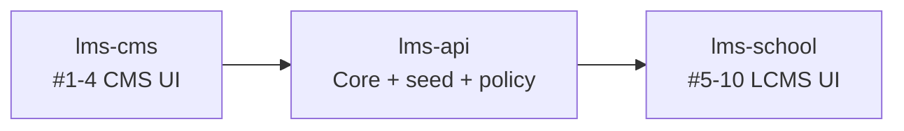

# Data_Default — Việc cần làm trên `lms-school`

**Nguồn yêu cầu:** `default-value-system/Data_Default.md`  
**Codebase:** `~/dtp/lms-school` (Next.js 15, React 18, TanStack Query — app **LCMS** quản trị trường/chi nhánh)  
**Backend:** `~/dtp/lms-api` — `Data_Default_lms-api.md`  
**CMS nội dung:** `~/dtp/lms-cms` — `Data_Default_lms-cms.md` (slide 2–7)  
**Ngày rà soát:** 2026-05-21

## Phạm vi repo này

| Phạm vi spec | Trong `lms-school`? |
|--------------|-------------------|
| **LCMS** (slide 8–12): TN theo role/khối/CN, seed CN, tiết học, GV–lớp | **Chủ yếu làm ở đây** (UI + gọi API) |
| **CMS** (slide 2–7): loại gói, mô tả gói, `is_default`, đóng gói 24 TN | **Không** — thuộc `lms-cms` |

**Kết nối API:** `NEXT_PUBLIC_API_BASE_URL` → `services/api/fetcher.js`, map path trong `services/api/config.js` (~1470 dòng).

---

## Tổng quan: đã có / thiếu

| # | Yêu cầu | Phạm vi | Trạng thái trên `lms-school` |
|---|---------|---------|------------------------------|
| 1 | Filter Loại gói | CMS | **Không** (repo khác) |
| 2 | Mô tả gói TN | CMS | **Không** |
| 3 | `is_default` tài nguyên | CMS | **Không** |
| 4 | Seed 24 TN + matrix | CMS + LCMS | **Không** (chỉ dùng series từ API) |
| 5 | Phân quyền TN GV/HS | LCMS | **Một phần** — UI matrix; chưa default theo spec |
| 6 | Auto-assign TN theo khối / lớp mới | LCMS | **Một phần** — “toàn khối”; **không** auto khi tạo lớp |
| 7 | Override TN theo chi nhánh | LCMS | **Một phần** — bật series theo CN + phân bổ lớp |
| 8 | Seed khi tạo chi nhánh | LCMS | **Chưa** — form CN thủ công; có template apply riêng |
| 9 | Seed tiết học mặc định | LCMS | **Một phần** — CRUD tiết + template PERIOD |
| 10 | GV chọn lớp khi **tạo** user | LCMS | **Chưa** — vai trò/lớp chỉ khi **sửa** user |

---

## Chi tiết theo yêu cầu

### 1–4 — CMS (slide 2–7)

**Không triển khai trong `lms-school`.** Làm trên `lms-cms` + BE (`Data_Default_lms-cms.md`, `Data_Default_lms-api.md`).

Màn **quản lý tài nguyên** ở đây chỉ **phân bổ / xem** series đã có (`/manage-resource`), không chỉnh gói CMS.

---

### 5 — Phân quyền tài nguyên theo role (slide 9)

**Hiện trạng**

- Phân bổ theo lớp: `ResourceDetail/RoleDetail/`, `RoleSelectDetail/`, `ResourceTable/index.js` — checkbox **TEACHER** / **STUDENT** + category từng item.
- API: `GET/POST /resources/classroom/allocation`, `createClassRoomAllocation`, `updateClassRoomAllocation` — `services/api/resource.js`, `config.js`.
- **Chưa** preset: GV = tất cả category; HS = học tập, bổ trợ, phòng đọc, vui học.

**Cần làm trên `lms-school`**

| Việc | File gợi ý |
|------|-------------|
| Khi mở form phân bổ / tạo allocation mới → áp default matrix theo role | `RoleSelectDetail/index.js`, `ResourceTable/index.js` |
| Map label category VN ↔ `EResourceCategory` API | `constants` hoặc helper `utils/resource.js` |
| (Tuỳ chọn) Màn cấu hình override theo CN | mở rộng `BranchRole/` hoặc màn system mới |

**Phụ thuộc BE:** policy mặc định + API list theo role — `Data_Default_lms-api.md` #5.

---

### 6 — Auto-assign tài nguyên theo khối; lớp mới kế thừa

**Hiện trạng**

- UI **“Toàn khối”** (`fullGrade`) trong `RoleDetail/index.js`.
- Chọn phạm vi lớp: `ClassSelection.js` trong luồng phân bổ.
- Tạo lớp: `ManageClass/`, `ClasssForm.js` → `classrooms.create` — **không** gọi copy allocation.

**Cần làm**

| Việc | File gợi ý |
|------|-------------|
| Sau tạo lớp thành công: toast + CTA “áp TN khối” hoặc **tự gọi** API clone allocation | `ClasssForm.js`, hook mutation classroom |
| Hoặc banner trên list lớp khi khối đã có `fullGrade` nhưng lớp mới chưa có TN | `ManageClass/` |
| Hiển thị trạng thái “lớp chưa được gán TN khối” | list/detail class |

**Phụ thuộc BE:** hook khi `POST /classrooms` — `Data_Default_lms-api.md` #6.

---

### 7 — Override tài nguyên theo chi nhánh

**Hiện trạng**

- `ResourceDetail/BranchRole/index.js`: bật/tắt **series** cho chi nhánh (`/resources/branch/allocation`).
- Phân bổ chi tiết theo lớp + role/category: `RoleSelectDetail/`.

**Cần làm (nếu spec yêu cầu override **quyền category** theo CN, không chỉ bật series)**

| Việc | Ghi chú |
|------|---------|
| UI chỉnh policy CN (nếu BE có `branch_resource_policy`) | Màn mới hoặc tab trong `BranchRole` |
| Hiện tại | Đủ cho “bật gói theo CN”; thiếu phần ghi đè rule GV/HS toàn CN |

**Phụ thuộc BE:** `Data_Default_lms-api.md` #7.

---

### 8 — Data mặc định khi tạo chi nhánh (slide 10)

**Hiện trạng**

- `BranchForm.js`: mã, tên, SĐT, địa chỉ, tỉnh/xã, ghi chú, trạng thái, logo — **không** “Loại chi nhánh”, **không** auto seed.
- `pages/manage-system/branch/` → `POST /branches` qua `services/api/branch.js`.
- Thay thế thủ công: `/tool/template-data` — apply `SCHOOL_YEAR`, `GRADE`, `SUBJECT`, `PERIOD` (`TemplateData/constants.js` — **không** type holiday/resource).
- Quản lý riêng: `/manage-system/school-year`, `grade`, `subject`, `holiday`.

**Cần làm trên `lms-school`**

| Việc | File gợi ý |
|------|-------------|
| Select **Loại chi nhánh** (Mầm non / Tiểu học / THCS / …) | `BranchForm.js`, `ManageSystem/Branch/` |
| (Tuỳ chọn) Gợi ý / auto-fill mã `CN_XX` | `BranchForm.js` + API gợi ý seq từ BE |
| Sau create success: hiển thị wizard “Đã khởi tạo: năm học, khối, môn, ngày lễ…” hoặc polling | `ManageBranch.js`, mutation `onSuccess` |
| Hoặc checkbox “Áp dụng cấu hình mặc định” → BE orchestrator | cùng form create |
| Mapping preview (read-only) trước khi tạo | component mới trong Branch |

**Phụ thuộc BE:** `BranchService` orchestrator + `branch_type` — `Data_Default_lms-api.md` #8.  
**Phụ thuộc BA:** mapping môn + gói TN theo loại CN.

---

### 9 — Seed tiết học mặc định (slide 11)

**Hiện trạng**

- CRUD tiết: `/manage-system/period`, `PeriodForm.js`, `services/api/period.js`.
- Template: `ModalApplyTemplate.js`, type `PERIOD` — apply **thủ công** cho CN/năm học.
- **Không** tự chạy khi tạo CN; giờ đầy đủ các tiết **chưa có** từ BA (Mr. Phục).

**Cần làm**

| Việc | File gợi ý |
|------|-------------|
| Gắn apply PERIOD template vào luồng tạo CN (#8) | `TemplateData` + branch create callback |
| Form/preview bảng tiết mặc định (khi có data giờ) | `Period/` hoặc wizard branch |
| Cấu hình Thứ 2–CN (scope) | đã có `periodscope` phía BE — UI apply whole branch |

**Phụ thuộc:** giờ tiết đầy đủ từ Mr. Phục; BE seed/template JSON.

---

### 10 — Phân bổ GV theo lớp tại màn tạo người dùng (slide 12)

**Hiện trạng**

- `CreateUser.js`: `isCreate = !userData` → chỉ render **`BasicInfoForm`**; **`BranchForm` / vai trò chỉ khi `!isCreate`** (dòng 163–196).
- Sau tạo user: redirect sang trang chi tiết để gán vai trò (flow hiện tại).
- Gán GV–lớp riêng: `/assign/head-teacher`, `/assign/subject-teacher` — `HeadTeacher.js`, `SubjectTeacher.js` — API `teacher-allocations`.
- `RoleListForm.js` có `classrooms` trên **edit**, không trên create.

**Cần làm**

| Việc | File gợi ý |
|------|-------------|
| Bỏ gate `!isCreate` hoặc thêm block “Vai trò & lớp (tuỳ chọn)” trên create | `CreateUser.js` |
| Multi-select **Lớp phụ trách** (optional), search/pagination nhiều lớp | component mới hoặc mở rộng `BranchForm.js` / `RoleListForm.js` |
| Gửi `classroomIds` / head + subject allocation trong `user.createUser` hoặc gọi thêm API sau create | `BasicInfoForm.js` submit, `services/api/user.js` |
| Validation: **không bắt buộc** lớp | form rules |
| Đồng bộ với `/assign/*` nếu user gán sau | tránh trùng logic — dùng chung service |

**Phụ thuộc BE:** mở rộng `CreateUserForm` + `TeacherAllocationService` — `Data_Default_lms-api.md` #10.

---

## Màn hình / route hiện có (LCMS)

| Chức năng | Route | Thư mục chính |
|-----------|-------|----------------|
| Chi nhánh | `/manage-system/branch` | `components/Pages/ManageSystem/Branch/` |
| Năm học / Khối / Môn / Ngày lễ / Tiết | `/manage-system/*` | `ManageSystem/SchoolYear`, `Grade`, `Subject`, `Holiday`, `Period` |
| Template apply | `/tool/template-data` | `components/Pages/Tool/TemplateData/` |
| Tài nguyên & phân bổ | `/manage-resource`, `.../series-detail`, `.../list/[classroomId]` | `components/Pages/ManageResource/` |
| Lớp học | `/manage-class` | `components/Pages/ManageClass/` |
| Người dùng | `/manage-user`, `/manage-user/create` | `components/Pages/ManageUser/` |
| Phân công GV | `/assign/head-teacher`, `/assign/subject-teacher` | `components/Pages/Assign/Teacher/` |

Định tuyến: `constants/paths.js`, `pages/`.

---

## API `lms-api` dùng nhiều (tham chiếu)

| Nghiệp vụ | Path (trong `services/api/config.js`) |
|-----------|----------------------------------------|
| Chi nhánh | `branch.*` → `/branches` |
| Template | `templateData.*` → `/template-data`, `/template-data/apply` |
| TN phân bổ CN | `/resources/branch/allocation` |
| TN phân bổ lớp | `/resources/classroom/allocation`, create/update allocation |
| User | `user.createUser`, `user.assignBranchRole` |
| GV allocation | `allocate.allocateHeadTeacher`, `allocate.allocateSubjectTeacher` |
| Tiết / ngày lễ | `period.*`, `holidays.*` |
| Lớp | `classrooms.*` |

Header `branchId` từ cookie — `storageKeys.branchId` trong `fetcher.js`.

---

## Thứ tự triển khai đề xuất (FE `lms-school`)

1. **#8 + #9** — Loại CN + wizard/post-create seed (phụ thuộc BE orchestrator).  
2. **#10** — Lớp phụ trách optional trên create user (có thể song song BE).  
3. **#5 + #6** — Default role matrix + UX sau tạo lớp / auto-assign.  
4. **#7** — chỉ khi BE có policy override CN.

**CMS #1–4:** không làm trong repo này.

**Ước lượng FE LCMS:** xem `est.md` (các mục FE-3, FE-4, FE-5 và phần LCMS trong bảng BE).

---

## Phân chia 3 repo

---

## Điểm chặn

| # | Nội dung | Owner |
|---|----------|--------|
| 1 | Giờ đầy đủ bảng tiết | Mr. Phục |
| 2 | Mapping môn + gói TN theo loại CN | Chuyên môn |
| 3 | Danh sách ngày lễ seed | BA / Product |
| 4 | Rule mã `CN_XX` | BA / Dev |

---

## Liên quan

- Spec: `default-value-system/Data_Default.md`  
- Backend: `default-value-system/Data_Default_lms-api.md`  
- CMS: `default-value-system/Data_Default_lms-cms.md`  
- Estimate: `default-value-system/est.md`
