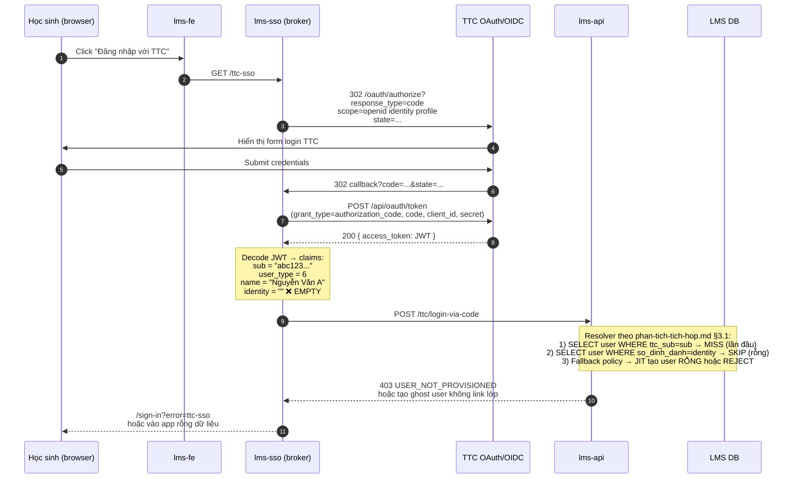
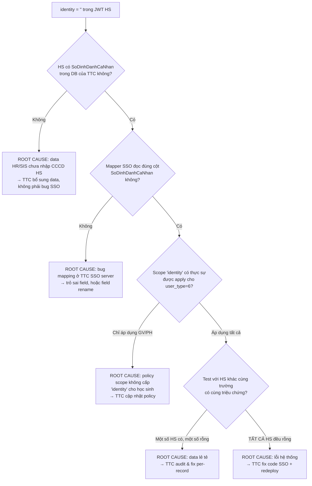

## 1. Tóm tắt vấn đề

Khi học sinh đăng nhập qua TTC SSO (`response_type=code`, scope `openid identity` đã được TTC cấp), JWT trả về có claim **`identity = ""` (chuỗi rỗng)** thay vì giá trị `SoDinhDanhCaNhan` (CCCD) của học sinh.

**Hệ quả:**

- LMS **không bridge được** user TTC SSO → record OpenSync `thongtinhocsinh` đã sync (vì OpenSync key theo `SoDinhDanhCaNhan`).
- Toàn bộ HS đăng nhập SSO **không match** được lớp/khối/niên học → app HS rỗng dữ liệu.
- Fallback duy nhất là `ttc_sub` — nhưng `sub` này **không** trùng với key của OpenSync → không thể lookup record HS đã sync.

→ Toàn bộ tính năng phụ thuộc identity của HS bị block đến khi TTC fix.

---

## 2. Sequence diagram — luồng hiện tại bị lỗi

### 2.1 Mermaid (cho dev / paste vào ticket)



### 2.2 ASCII (cho người đọc non-dev / paste vào email TTC)

```text
                  [LUỒNG HIỆN TẠI — BỊ LỖI]

  [HS browser]                                  [TTC SSO]
        |                                            |
        | 1) Click "Đăng nhập TTC"                   |
        v                                            |
  [lms-sso] ──── 2) /oauth/authorize ──────────────► |
                  scope = openid identity profile    |
                                                     |
                                              HS nhập user/pass
                                                     |
        |◄─── 3) callback?code=... ───────────────── |
        |                                            |
  [lms-sso] ──── 4) POST /api/oauth/token ─────────► |
        |                                            |
        |◄─── 5) { access_token: JWT } ────────────  |
        |                                            |
        v
  [lms-sso decode JWT]
        |
        | JWT payload:
        | {
        |   "sub": "414",
        |   "user_type": "6",
        |   "scope": "openid profile identity",
        |   "jti": "84593fa4-32c3-4c41-b462-b7eebfd6a8cb",
            "given_name": "Lớp 2",
            "family_name": "HS",
            "name": "HS Lớp 2",
            "picture": "",
            "identity_number": "",           ❌ RỖNG — KHÔNG có CCCD
            "nbf": 1778476387,
            "exp": 1778479987,
            "iat": 1778476387,
            "iss": "ASC_SCHOOL"
        | }
        |
        v
  [lms-api resolver]
        |
        |  SELECT user WHERE so_dinh_danh = ""           → KHÔNG match record OpenSync
        |
        v
  ❌ KHÔNG BRIDGE ĐƯỢC sang record HS đã sync từ OpenSync
     (LMS đã có HS này nhờ thongtinhocsinh — chỉ thiếu link với SSO)
```

---

## 3. So sánh Expected vs Actual

### 3.1 JWT payload mong đợi (theo `HuongDan_SSO_DoiTac.docx`)

```json
{
  "sub":         "abc123def456",
  "user_type":   6,
  "scope":       "openid identity profile",
  "name":        "Nguyễn Văn A",
  "given_name":  "A",
  "family_name": "Nguyễn Văn",
  "identity":    "079...XXXXXX",         ← 12 chữ số CCCD
  "jti":         "uuid-...",
  "iss":         "https://sso.ttc.edu.vn",
  "exp":         1736111111,
  "iat":         1736108111
}
```

### 3.2 JWT payload thực tế (đang nhận được)

```json
{
  "sub":         "abc123def456",
  "user_type":   6,
  "scope":       "openid identity profile",
  "name":        "Nguyễn Văn A",
  "given_name":  "A",
  "family_name": "Nguyễn Văn",
  "identity":    "",                     ❌ chuỗi rỗng
  "jti":         "uuid-...",
  "iss":         "https://sso.ttc.edu.vn",
  "exp":         1736111111,
  "iat":         1736108111
}
```

### 3.3 Bảng đối chiếu

| Mục | Expected | Actual | Status |
|-----|----------|--------|--------|
| Scope yêu cầu trong `/oauth/authorize` | `openid identity profile` | `openid identity profile` | ✅ giống |
| Scope cấp trong JWT (claim `scope`) | có `identity` | có `identity` | ✅ giống |
| Claim `identity` xuất hiện trong JWT | ✅ có | ✅ có | ✅ |
| **Giá trị claim `identity`** | **12 chữ số CCCD** | **`""` (rỗng)** | ❌ **LỖI** |
| Claim `sub` | bền vững | bền vững | ✅ |

→ Scope đã được cấp và claim đã có trong payload, **chỉ có giá trị bị rỗng**.

---

## 4. Cây quyết định — TTC tự debug nguyên nhân



---

## 5. Sample test — TTC verify với data thật

Để TTC reproduce, LMS gửi kèm 1 HS sample đã đăng nhập (sau khi confidential mask). TTC kiểm tra:

| Thông tin LMS gửi | TTC kiểm tra |
|-------------------|----------------|
| `sub` của JWT (đầy đủ) | Tra ngược user record trong TTC DB |
| `MaTruong` (đã sync qua OpenSync) | Confirm cùng trường |
| Họ tên hiển thị từ claim `name` | Confirm đúng người |
| Thời điểm login (timestamp `iat`) | Lấy log SSO server cùng thời điểm |

Đối chiếu trong TTC DB:

1. `SoDinhDanhCaNhan` của HS này trong bảng học sinh TTC = ? (rỗng / có giá trị?)
2. Nếu có giá trị → tại sao SSO mapper không trả về?
3. Nếu rỗng → cùng HS này có xuất hiện trong response `opensync.thongtinhocsinh` không? (Vì OpenSync có trả `SoDinhDanhCaNhan` — nếu OpenSync trả giá trị thật mà SSO trả rỗng thì 2 hệ thống TTC đang đọc từ source khác nhau.)

> ⚠️ Nếu **OpenSync có giá trị `SoDinhDanhCaNhan` nhưng SSO trả rỗng** → đây là dấu hiệu **2 module trong TTC đọc từ 2 nguồn data khác nhau** — đáng để TTC IT điều tra ưu tiên cao.

---

## 6. Câu hỏi cụ thể cần TTC confirm

### Nhóm A — Verify hiện trạng

1. Với HS sample do LMS cung cấp (sub `abc123…`), trong DB của TTC có `SoDinhDanhCaNhan` không, và giá trị là gì?
2. Cùng HS đó khi gọi `GET /api/opensync/thongtinhocsinh?SoDinhDanhCaNhan=…` có trả về record không? Field `SoDinhDanhCaNhan` trong response OpenSync có rỗng không?
3. Scope `identity` được cấp cho client của LMS — có **giới hạn theo `user_type`** không (vd chỉ áp dụng GV/PH, không áp dụng HS)?

### Nhóm B — Root cause

4. Mapper trên TTC SSO server đọc `identity` từ field nào của user record? (tên cột chính xác trong DB / API nội bộ)
5. Test phía TTC: tạo 1 HS test có `SoDinhDanhCaNhan` đã verify trong DB → login SSO → JWT có ra `identity` không?
6. Có phân biệt giữa `SoDinhDanhCaNhan` (CCCD) và `SoCMND` (CMND cũ) không? Một số HS chỉ có CMND mà không có CCCD — TTC có fallback cho trường hợp này không, hay trả rỗng?

### Nhóm C — Hành động khắc phục

7. Nếu là vấn đề data (HS thiếu CCCD trong DB TTC) → TTC có cơ chế cập nhật batch cho LMS biết khi nào data sẵn sàng không?
8. Nếu là vấn đề code mapper → TTC cam kết timeline fix? Có thể hot-patch hay phải qua release cycle?
9. **Trong thời gian chờ fix**, TTC có thể cấp tạm 1 claim khác để LMS bridge không? Ví dụ:
   - claim `user_id` (PK của TTC) + bổ sung field `user_id` cùng record OpenSync → LMS join theo `user_id`;
   - hoặc claim `student_code` (mã HS nội bộ trường) — có sẵn trong cả SSO và OpenSync.

### Nhóm D — Phòng ngừa tương lai

10. TTC có thể bổ sung **healthcheck endpoint** trả thống kê % HS có `SoDinhDanhCaNhan` không (để LMS monitor liên tục)?
11. Khi data HS có CCCD bị xoá / rỗng sau update → TTC có notify LMS không?

---

## 7. Đề xuất action ngay (không chờ TTC fix)

### 7.1 LMS side

| # | Hành động | Chủ động |
|---|-----------|-----------|
| 1 | Thêm log warning cấp ERROR khi nhận JWT HS có `identity=""` (hiện chỉ log info) → để monitor số ca | LMS dev |
| 2 | Trong resolver: nếu `identity` rỗng + `user_type=6` → **REJECT** ngay với mã `TTC_SSO_STUDENT_IDENTITY_EMPTY` thay vì fallback JIT (tránh tạo ghost HS) | LMS dev |
| 3 | Hiển thị UX rõ ràng: "Tài khoản của bạn thiếu số định danh — liên hệ trường để cập nhật" | LMS FE |
| 4 | Build admin tool ánh xạ thủ công `ttc_sub` ↔ `student_id` (qua tên + ngày sinh) làm fallback ngắn hạn | LMS BE + FE |
| 5 | Báo metric `ttc_sso.student.identity_empty` gửi alert ops mỗi 10 lần fail / 5 phút | LMS infra |

### 7.2 Đối chiếu data nội bộ

Chạy 1 query trên DB OpenSync đã sync để biết tỷ lệ:

```sql
SELECT
  COUNT(*) AS total_hs,
  COUNT(NULLIF(so_dinh_danh_ca_nhan, '')) AS hs_co_cccd,
  COUNT(*) - COUNT(NULLIF(so_dinh_danh_ca_nhan, '')) AS hs_thieu_cccd
FROM hoc_sinh
WHERE source = 'TTC_OPENSYNC';
```

→ Nếu OpenSync **có giá trị** cho phần lớn HS, càng khẳng định lỗi nằm ở SSO mapper, không phải data thiếu.

→ Nếu OpenSync **cũng rỗng** thì gốc rễ là HR/SIS của TTC chưa nhập CCCD → vấn đề data, cần TTC kết hợp phòng học vụ.

---

## 8. Đính kèm gửi TTC

Khi gửi ticket / email cho TTC nên kèm:

1. **File này** (rút gọn — bỏ phần "Đề xuất action LMS side" §7).
2. **Sample JWT** đã decode (mask `sub` và `jti`).
3. **3–5 HS mẫu** với: `sub`, `MaTruong`, họ tên (từ claim `name`), timestamp login → để TTC tra log.
4. **Screenshot màn báo lỗi** trên LMS phía user (UX hint cho TTC hình dung impact).

---

*Mở: <ngày phát hiện>. Cập nhật khi: TTC phản hồi nhóm A/B/C/D, hoặc khi quyết định fallback bridge tạm thời.*
